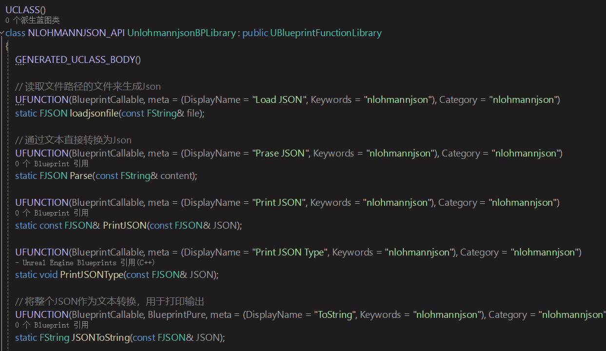

# NJson
### 使用Github上Star数最高的JSON库[https://github.com/nlohmann/json]来对UE做的中间层扩展
- 目前支持读取文件来加载json数据，无需事先定义结构，可以按需解析任何json结构；
- 支持读取文本解析为JSON结构数据；
- 支持读取数组、对象、字符串、float、int、bool作为值读取与转化；
- 支持文本有中文的解析；

自定义了与蓝图通讯的结构**FJSON**，全部方法都写在继承UBlueprintFunctionLibrary的函数库中：

