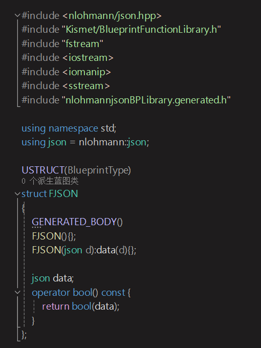

# NJson
### 使用Github上Star数最高的JSON库 <https://github.com/nlohmann/json> 来对UE做的中间层扩展, 目前支持：
- 读取文件来加载json数据，无需事先定义结构，可以按需解析任何json结构；
- 读取文本解析为JSON结构数据；
- 读取数组、对象、字符串、float、int、bool作为值读取与转化；
- 中文utf8转码解析；

 

自定义了与蓝图通讯的结构**FJSON**，全部方法都写在继承UBlueprintFunctionLibrary的函数库中：

----
# Epic Unreal Store Information

## Brief
A Json Plugin for UE extend by Github 40K star Json Lib.

## Details Description
Use BlueprintFunctionLibrary package all nlohmannjson's functions, easy to use in blueprint flexibly.

## Technical Details
特点：（请附上完整、全面的产品功能列表） 
代码模块：（请包括每个插件模块及其模块类型（运行时、编辑器等）的完整列表） 
蓝图数量： 
C++ 类的数量： 
网络复制：否 
支持的开发平台：Windows 
支持的目标构建平台：Windows 
文档：https://github.com/Zedidle/nlohmannjsonForUE 
示例项目：（将这些括号替换为链接，以下载依赖于您的插件但不分发实际插件的示例项目） 
重要/附注事项：

